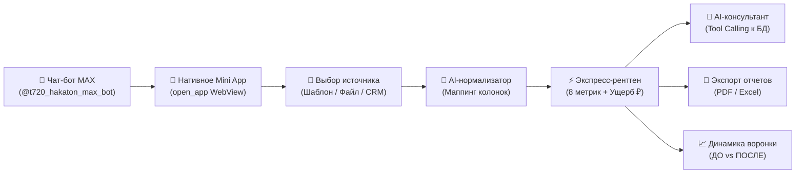

<div align="center">

# 🩺 AI Business X-Ray

**Интеллектуальная система экспресс-диагностики, финансового аудита и поиска точек роста малого и микробизнеса для платформы MAX**

[](https://max.ru/t720_hakaton_max_bot?startapp)
[](https://react.dev/)
[](https://www.djangoproject.com/)
[](https://www.postgresql.org/)
[](https://www.docker.com/)
[](https://xray-business-bot.online/api/docs/)
[](https://opensource.org/licenses/MIT)

**Хакатон:** Трек «Эффективный бизнес» (Минобрнауки России & Мессенджер MAX) · **Команда:** quota exceeded

[🌐 Веб-сервис (Live Demo)](https://xray-business-bot.online) · [📱 Чат-бот в MAX (@t720_hakaton_max_bot)](https://max.ru/t720_hakaton_max_bot?startapp) · [📑 Swagger UI (OpenAPI 3.1)](https://xray-business-bot.online/api/docs/) · [🧪 План проверки (DATA-API.yaml)](https://xray-business-bot.online/DATA-API.yaml)

---

</div>

## 📑 Оглавление

- [1. Назначение решения](#1-назначение-решения)
  - [1.1. Миссия и концепция](#11-миссия-и-концепция)
  - [1.2. Целевая аудитория и сегмент](#12-целевая-аудитория-и-приоритетный-пользовательский-сегмент)
  - [1.3. Обоснование актуальности (ФНС, Росстат, МСП)](#13-обоснование-проблемы-и-актуальность)
  - [1.4. Формулировка проблемы](#14-формулировка-проблемы-по-методике-хакатона)
  - [1.5. Трансформация процесса: As Is vs To Be](#15-трансформация-процесса-as-is-vs-to-be)
  - [1.6. Границы MVP по методологии MoSCoW](#16-границы-mvp-по-методологии-moscow)
- [2. Основной пользовательский сценарий](#2-основной-пользовательский-сценарий)
- [3. Состав и архитектура решения](#3-состав-и-архитектура-решения)
- [4. Запуск всех компонентов одной командой через Docker](#4-запуск-всех-компонентов-одной-командой-через-docker)
- [5. Необходимые параметры и переменные окружения](#5-необходимые-параметры-и-переменные-окружения)
- [6. Используемые сетевые порты](#6-используемые-сетевые-порты)
- [7. Зависимости](#7-зависимости)
- [8. Внешние сервисы и интеграции](#8-внешние-сервисы-и-интеграции)
- [9. Описание работы с данными](#9-описание-работы-с-данными)
- [10. Порядок работы с тестовыми данными](#10-порядок-работы-с-тестовыми-данными)
- [11. Пошаговый сценарий проверки](#11-пошаговый-сценарий-проверки)
- [12. Примеры ожидаемого поведения системы](#12-примеры-ожидаемого-поведения-системы)
- [13. Известные ограничения](#13-известные-ограничения)
- [14. Порядок остановки и повторного запуска решения](#14-порядок-остановки-и-повторного-запуска-решения)
- [15. Только для решений с собственным API](#15-только-для-решений-с-собственным-api)
- [16. Платформенный бонус MAX (+0,15 балла)](#16-платформенный-бонус-за-расширенное-использование-возможностей-max-015-балла)
- [17. Потенциал масштабирования и пилотный запуск](#17-потенциал-масштабирования-решения-и-план-пилотного-запуска)
- [18. Структура репозитория](#18-структура-репозитория)

---

## 1. Назначение решения

### 1.1. Миссия и концепция
**AI Business X-Ray** — цифровой инструмент оперативного финансового «рентгена» и аудита воронки продаж, созданный для предпринимателей, руководителей отделов продаж (РОП) и генеральных директоров сегмента малого и микробизнеса (B2B-продажи, оптовая торговля, E-commerce, заказные услуги).

Сервис подключается к данным продаж компании (через загрузку таблиц Excel/CSV, готовых отраслевых шаблонов или прямую интеграцию с CRM), за 1–2 секунды выявляет скрытые финансовые утечки (зависшие сделки, удлинение цикла продаж, несанкционированные скидки, риск оттока ключевых клиентов, запоздалый первый контакт), вычисляет точный ущерб в рублях и предоставляет руководителю интерактивного AI-консультанта с доступом к базе данных через механизм **Tool Calling**.

> **Принцип надежности и защиты от галлюцинаций**  
> AI **не вычисляет финансовые показатели и не гадает на цифрах**. Расчет всех 8 бизнес-метрик, финансового ущерба (`money_impact`) и уровней угроз выполняется строгим детерминированным математическим ядром по формулам. LLM формирует выводы живым деловым языком, отвечает на вопросы в чате через реальные SQL-запросы к БД и помогает сопоставлять нестандартные колонки через **AI-нормализатор**.

### 1.2. Целевая аудитория и приоритетный пользовательский сегмент
- **Приоритетный пользователь:** Предприниматель / Владелец бизнеса / Руководитель отдела продаж (РОП).
- **Сегмент:** Малый и микробизнес с регулярной воронкой продаж (от 50 до 10 000 сделок в месяц), средним циклом сделки от 3 до 60 дней и штатом менеджеров по продажам от 1 до 20 человек.
- **Отрасли:** B2B-дистрибуция и опт, розничная интернет-торговля (E-commerce), контрактное производство, заказные услуги для бизнеса.

### 1.3. Обоснование проблемы и актуальность
По данным **Единого реестра субъектов МСП (ФНС России, 2026)**, в стране зарегистрировано свыше **6,6 млн субъектов МСП** (81,8% всех действующих юрлиц и ИП). При этом:
1. **Кадровый дефицит и нагрузка:** по данным Росстата (2026), потребность в кадрах превышает 1,8 млн человек. Владельцы бизнеса и РОПы перегружены операционной рутиной и не успевают вручную анализировать сотни сделок.
2. **Финансовые риски:** в первом полугодии 2026 года бизнес привлек более 370 млрд рублей заемного финансирования (Корпорация МСП). В условиях высокой стоимости оборотного капитала замораживание денег в «зависших» сделках и бесконтрольные скидки ведут к кассовым разрывам.
3. **Разрозненность данных:** малый бизнес ведет учет в разных системах (1С, МойСклад, amoCRM, выгрузки маркетплейсов, таблицы Excel). Ручной аудит занимает дни и недели, а нанимать аналитиков малому бизнесу нерентабельно.

### 1.4. Формулировка проблемы (по методике хакатона)
> Предприниматель / РОП в ситуации операционного управления продажами и распределения ресурсов хочет сохранить маржинальность, вовремя закрывать сделки и предотвращать кассовые разрывы, но сталкивается с разрозненностью таблиц, человеческим фактором менеджеров и отсутствием мгновенной аналитики узких мест, из-за чего теряет от 15% до 35% потенциальной выручки, морозит оборотные средства и принимает управленческие решения вслепую.

### 1.5. Трансформация процесса: As Is vs To Be

| Параметр | Текущий процесс (As Is) | Будущий процесс с X-Ray (To Be) |
| :--- | :--- | :--- |
| **Сбор данных** | Ручная выгрузка из CRM/1С, чистка колонок, сведение формул в Excel (от 3 до 8 часов). | Загрузка файла любого формата (или выбор шаблона в 1 клик) прямо в мессенджере MAX (5 секунд). |
| **Сопоставление полей** | Ручная переименовка нестандартных колонок. | **AI-нормализатор** автоматически определяет семантику сленговых и нестандартных названий. |
| **Поиск уязвимостей** | Ручной просмотр сотен строк, пропуск неочевидных системных аномалий. | Детерминированное математическое ядро рассчитывает 8 метрик за 1,5 секунды. |
| **Оценка ущерба** | Абстрактные проценты конверсий без привязки к финансам. | Точный расчет замороженных и потерянных средств в рублях (`money_impact`). |
| **Поиск причин** | Длительные расспросы менеджеров на планерках. | Вопрос AI-консультанту в чате (с реальным выполнением SQL-запросов через **Tool Calling**). |
| **Отчетность** | Ручное составление сводок и презентаций. | Мгновенный экспорт официального **PDF-заключения** и расширенного **Excel-аудита**. |

### 1.6. Границы MVP

<details open>
<summary><b>Развернуть детализацию границ продукта</b></summary>

- **Must Have (Обязательно в текущем релизе):**
  - Кроссплатформенное мини-приложение в MAX (веб и мобильная адаптация) на базе `@maxhub/max-ui` и `MAX Bridge`.
  - Чат-бот MAX (`@t720_hakaton_max_bot`) со сценарием бесшовного перехода в Mini App.
  - Детерминированное ядро расчета 8 ключевых бизнес-метрик с финансовой оценкой в рублях.
  - AI-нормализатор структуры колонок для обработки произвольных таблиц (CSV, XLSX, XLS).
  - Встроенный интерактивный AI-консультант с поддержкой **Tool Calling** (выборка сделок из БД).
  - Набор готовых отраслевых шаблонов (E-commerce, 1С, Wildberries/Ozon, сленговая CRM).
  - Экспорт официальных отчетов в PDF и Excel.
  - Полная поддержка спецификации OpenAPI 3.1 и плана тестирования `DATA-API.yaml`.
- **Should Have (Важно для практической ценности):**
  - Сравнение периодов продаж ДО и ПОСЛЕ (оценка спасенных средств).
  - Модуль анонимизации персональных данных клиентов (152-ФЗ PII Anonymizer) перед отправкой в LLM.
- **Could Have (Перспективное развитие):**
  - Двусторонняя синхронизация с amoCRM по OAuth 2.0.
  - Автоматическая генерация рекомендаций по мерам господдержки (интеграция с МСП.РФ).
- **Won't Have (Сознательно исключено из рамок MVP):**
  - Громоздкие интеграции с тяжелыми enterprise ERP (SAP, 1С:УПП).
  - Автоматическая безакцептная рассылка сообщений клиентам без подтверждения человеком.

</details>

---

## 2. Основной пользовательский сценарий

Пользовательский сценарий полностью реализован и доступен как в мобильной, так и в веб-версии платформы **MAX**:



1. **Вход через чат-бот MAX:** Пользователь находит бота в мессенджере MAX, нажимает кнопку **«Старт»** и запускает встроенное мини-приложение кнопкой **«🚀 Открыть мини-приложение»**.
2. **Выбор источника данных:** На главном экране пользователь может:
   - Загрузить файл своей выгрузки (`.csv`, `.xlsx`, `.xls`) через Drag & Drop;
   - Выбрать готовый пресет из меню **«Шаблон ▼»** (*Стандартный E-commerce*, *1С / МойСклад*, *Wildberries / Ozon*, *Сленговая CRM*);
   - Подключить воронку amoCRM по OAuth 2.0.
3. **AI-нормализация и маппинг:** Система мгновенно сопоставляет поля таблицы с канонической схемой сделок. Для колонок со сленговыми названиями подключается AI-нормализатор.
4. **Экспресс-диагностика («Рентген воронки»):** За 1,5 секунды математическое ядро рассчитывает метрики и выводит:
   - Общий балл здоровья воронки и сумму финансового ущерба в рублях;
   - Карточки критических угроз (зависшие сделки, утечка маржи через скидки, длинный цикл, отвал на первом шаге, риск потери топ-клиентов);
   - Детализацию с формулами и списком проблемных сделок.
5. **Интерактивный AI-консультант:** Пользователь нажимает **«Задать вопрос AI»** и формулирует запрос на естественном языке (*«Кто из менеджеров дал максимальные скидки?»*, *«Покажи зависшие заказы дороже 300 000 руб.»*). LLM вызывает функции базы данных (**Tool Calling**), находит нужные сделки и формирует аргументированный ответ со ссылками на цифры.
6. **Сравнение периодов (Динамика):** Пользователь может сравнить два среза продаж (например, до оптимизации регламента и после) и увидеть сумму спасенной выручки.
7. **Выгрузка результатов:** Генерация брендированного презентационного **PDF-отчета** для руководства и детального **Excel-реестра** проблемных сделок для РОПа.

---

## 3. Состав и архитектура решения

```
┌────────────────────────────────────────────────────────────────────────┐
│                      Пользовательский уровень                          │
│   Мессенджер MAX (iOS, Android, Desktop, Web)  /  Современный Браузер │
└───────────────────────────────────┬────────────────────────────────────┘
                                    │ HTTPS (TLS 1.3) / WSS
┌───────────────────────────────────▼────────────────────────────────────┐
│                        Nginx (Reverse Proxy)                           │
│     Статика SPA + проксирование API, Django Admin, Swagger UI, Specs   │
└──────────────────┬─────────────────────────────────┬───────────────────┘
                   │                                 │
                   ▼                                 ▼
┌──────────────────────────────────────┐  ┌──────────────────────────────┐
│       Backend (Django 5 / DRF)       │  │    PostgreSQL 16 Database    │
│  - Детерминированный расчет 8 метрик │  │  - Снимки (Snapshot)         │
│  - AI-нормализатор маппинга колонок  │◄─┤  - Реестр сделок (Deal)      │
│  - 152-ФЗ PII Anonymizer             │  │  - История чатов (Message)   │
│  - Swagger UI / OpenAPI 3.1          │  │  - Учет токенов (LLMUsage)   │
│  - Генератор отчетов PDF & Excel     │  └──────────────────────────────┘
└──────────────────┬───────────────────┘
                   │
                   ▼
┌────────────────────────────────────────────────────────────────────────┐
│                      Внешние сервисы и API                             │
│  - OpenAI-API совместимая LLM (Нарратив, Tool Calling, Normalizer)     │
│  - MAX Bot API (Чат-бот @t720_hakaton_max_bot, вебхуки, инлайн-кнопки)       │
│  - amoCRM REST API v4 (Синхронизация сделок по OAuth 2.0)              │
└────────────────────────────────────────────────────────────────────────┘
```

### Компоненты системы
1. **Frontend / Mini App ([`xray-fe/`](xray-fe/)):** SPA на React 19, TypeScript, Vite. Интерфейс построен на нативной библиотеке компонентов `@maxhub/max-ui` и SDK `MAX Bridge` с адаптацией под мобильные и десктопные клиенты MAX.
2. **Backend API & Engine ([`xray-be/`](xray-be/)):** Python 3.11, Django 5.2, Django REST Framework, Gunicorn. Обеспечивает математические расчеты, генерацию отчетов, валидацию сессий MAX и контракты OpenAPI 3.1.
3. **Database (`postgres`):** PostgreSQL 16 Alpine с поддержкой нативных JSONB-полей для хранения снимков метрик и быстрых аналитических выборок.
4. **Proxy & Web Server (`nginx`):** Nginx Alpine, обеспечивающий SSL-терминацию, сжатие gzip, кэширование статики и безопасный роутинг запросов.
5. **MAX Bot Module ([`max-bot/`](max-bot/)):** Node.js сервис на базе `@maxhub/max-bot-api` для обработки событий и команд мессенджера MAX.

---

## 4. Запуск всех компонентов одной командой через Docker

В соответствии с регламентом хакатона, все локальные компоненты системы разворачиваются **ровно одной стандартной командой** из корня репозитория:

```bash
docker compose up -d --build
```
*(или `docker-compose up -d --build`)*


### Точки входа после запуска:

| Сервис | Локальный адрес | Назначение |
| :--- | :--- | :--- |
| **Веб-интерфейс / Mini App** | [http://localhost:5173](http://localhost:5173) | Главное пользовательское приложение |
| **Интерактивный Swagger UI** | [http://localhost:5173/api/docs/](http://localhost:5173/api/docs/) | Документация и тестирование API |
| **Django Admin** | [http://localhost:5173/admin/](http://localhost:5173/admin/) | Служебная панель Django (для разработчиков) |
| **Спецификация OpenAPI 3.1** | [http://localhost:5173/openapi.yaml](http://localhost:5173/openapi.yaml) | Машиночитаемая схема API |
| **План проверки DATA-API** | [http://localhost:5173/DATA-API.yaml](http://localhost:5173/DATA-API.yaml) | Конфигурация сценариев автопроверки |

---

## 5. Необходимые параметры и переменные окружения

Перед первым запуском скопируйте файл конфигурации `.env` из эталонного шаблона:

```bash
cp .env.example .env
```


| Переменная | Обязательно | Назначение | Значение по умолчанию в Docker |
| :--- | :---: | :--- | :--- |
| `DEBUG` | Нет | Режим отладки бэкенда (`true`/`false`) | `false` |
| `SECRET_KEY` | Да | Секретный ключ Django | Преднастроен безопасный ключ |
| `ALLOWED_HOSTS` | Нет | Разрешенные HTTP-хосты | `*` |
| `CSRF_TRUSTED_ORIGINS` | Нет | Доверенные источники для CSRF | `http://localhost,https://xray-business-bot.online` |
| `DB_ENGINE` | Нет | Движок БД (`postgres` или `sqlite`) | `postgres` |
| `POSTGRES_DB` | Да | Имя базы данных PostgreSQL | `xray_db` |
| `POSTGRES_USER` | Да | Пользователь базы данных | `xray_user` |
| `POSTGRES_PASSWORD` | Да | Пароль к базе данных | `xray_secret_password` |
| `POSTGRES_HOST` | Да | Хост подключения к БД в сети Docker | `postgres` |
| `POSTGRES_PORT` | Да | Сетевой порт PostgreSQL | `5432` |
| `OPENAI_API_KEY` | Да* | API-ключ OpenAI-API совместимой LLM | - |
| `OPENAI_BASE_URL` | Да* | Базовый URL OpenAI-совместимого провайдера | - |
| `OPENAI_MODEL` | Да* | Имя языковой модели в OpenAI-совместимом API | - |
| `MAX_BOT_TOKEN` | Да* | Токен чат-бота платформы MAX | Выдан организаторами хакатона |
| `MAX_BOT_USERNAME` | Нет | Имя чат-бота в мессенджере MAX | `t720_hakaton_max_bot` |
| `MAX_APP_URL` | Нет | URL мини-приложения для кнопок бота | `https://xray-business-bot.online` |

*\*Примечание: При отсутствии параметров конфигурации LLM (`OPENAI_API_KEY`, `OPENAI_BASE_URL`, `OPENAI_MODEL`) сервис сохраняет 100% работоспособность математического ядра аудита и формирует детерминированные выводы по встроенным шаблонам.*

---

## 6. Используемые сетевые порты

| Порт | Сервис / Контейнер | Назначение |
| :---: | :--- | :--- |
| **80** | `xray-frontend` (Nginx) | Основной шлюз: веб-интерфейс, раздача статики SPA, обратный прокси для `/api/`, `/admin/` |
| **5173** | `xray-frontend` (Nginx alias) | Альтернативный порт для совместимости со стандартным портом Vite dev |
| **8000** | `xray-backend` (Gunicorn) | Прямой доступ к Django REST API, Swagger UI, ReDoc и Django Admin |
| **5432** | `xray-postgres` (PostgreSQL 16) | Порт реляционной базы данных |

---

## 7. Зависимости

Все зависимости проекта строго зафиксированы версиями в файлах манифестов:
1. **Backend ([`xray-be/requirements.txt`](xray-be/requirements.txt)):**
   - Фреймворк и API: `Django>=5.0,<6.0`, `djangorestframework>=3.15.0`, `django-cors-headers>=4.3.0`
   - Спецификация API: `drf-spectacular>=0.27.0` (генерация OpenAPI 3.1)
   - База данных: `psycopg2-binary>=2.9.9`, `sqlparse>=0.5.0`
   - WSGI Сервер: `gunicorn>=21.2.0`, `asgiref>=3.8.0`
   - Аналитика и парсинг: `pandas>=2.2.0`, `openpyxl>=3.1.2`, `xlrd>=2.0.1`
   - Генерация документов: `reportlab>=4.1.0` (PDF-отчеты)
   - Сеть и окружение: `requests>=2.31.0`, `python-dotenv>=1.0.0`
2. **Frontend ([`xray-fe/package.json`](xray-fe/package.json) & `package-lock.json`):**
   - Библиотека MAX: `@maxhub/max-ui` (`^0.5.0`)
   - Ядро интерфейса: `react` (`^19.2.8`), `react-dom` (`^19.2.8`), `react-router` (`^8.4.0`)
   - Текст и Markdown: `marked` (`^18.0.14`)
   - Сборка и линтинг: `vite` (`^8.3.0`), `typescript` (`~6.0.2`), `oxlint` (`^1.81.0`), `vitest` (`^5.0.1`)
3. **MAX Chatbot ([`max-bot/package.json`](max-bot/package.json)):**
   - Официальный SDK: `@maxhub/max-bot-api` (`^0.3.1`)
   - Утилиты: `dotenv` (`^16.4.7`)

---

## 8. Внешние сервисы и интеграции

### 8.1. Перечень интеграций
1. **Платформа MAX (Мессенджер):**
   - Чат-бот `@t720_hakaton_max_bot` на базе `@maxhub/max-bot-api` (обработка команд, событий старта, генерация инлайн-кнопок `open_app`).
   - Мини-приложение на базе `@maxhub/max-ui` и SDK `MAX Bridge` (кроссплатформенная адаптация под iOS, Android, Desktop, Web).
   - Безопасная валидация контекста пользователя через заголовок `X-Max-Init-Data`.
2. **OpenAI-API совместимый LLM провайдер:**
   - Языковая модель подключается по стандартному протоколу OpenAI Chat Completions API и используется для:
     1. Формирования емкого бизнес-резюме аудита на основе детерминированных цифр;
     2. Интерактивного консультирования в потоковом SSE-чате с механизмом **Tool Calling**;
     3. Семантического AI-маппинга сленговых и нестандартных названий колонок.
3. **amoCRM (REST API v4 & OAuth 2.0):**
   - Синхронизация воронок, этапов и сделок компании с автоматическим формированием аналитических срезов.

### 8.2. Внешние сервисы, необходимые для проверки MVP и условия их воспроизведения
- **Сервис внешнего LLM:** Для генерации текстовых ответов нейросети требуется доступ в интернет к эндпоинту модели.  
  *Условие автономности:* Если доступ к LLM отсутствует или ключ не задан, в бэкенд встроен **детерминированный Fallback-генератор**, который формирует полное экспертное заключение по шаблонам бизнес-правил. Все математические расчеты, выгрузка PDF/Excel и просмотр карточек угроз работают на 100% автономно внутри Docker без внешних зависимостей.
- **Платформа MAX:** Проверка взаимодействия чат-бота и Mini App выполняется в реальном клиенте MAX. Для локального изолированного тестирования без клиента MAX веб-интерфейс полностью доступен в стандартном браузере по адресу `http://localhost:5173`.

---

## 9. Описание работы с данными

В проекте реализованы ключевые принципы надежности и безопасности:

1. **Разделение фактов, расчетов и рекомендаций:**
   - **Строгие расчеты (Математическое ядро):** Все 8 метрик (конверсия, средний чек, зависание сделок, распределение скидок, скорость реакции, цикл сделки, отвал на 1-м этапе, концентрация на ключевых клиентах), а также финансовый ущерб в рублях (`money_impact`) рассчитываются строго детерминированными формулами в Python ([`engine/analyzer.py`](xray-be/xray_be/engine/analyzer.py)).
   - **Генеративные рекомендации:** Нейросеть привлекается исключительно для интерпретации уже вычисленных цифр и формулирования понятных управленческих шагов.
2. **Учет ограничений генеративного ИИ (Защита от галлюцинаций):**
   - Языковая модель **никогда не производит математических расчетов** финансовых показателей.
   - В чате используется архитектура **Tool Calling**: при вопросе пользователя модель вызывает детерминированные инструменты базы данных и опирается только на реальные факты из БД.
3. **152-ФЗ Комплаенс (PII Anonymizer):**
   - В модуле `engine/anonymizer.py` реализовано автоматическое обезличивание персональных данных (ФИО клиентов, телефоны, email) до передачи контекста во внешние LLM-системы.
4. **Хранение в PostgreSQL:**
   - Модель `Snapshot`: хранит метаданные аудита, сводные показатели и нативные `JSONB` структуры метрик.
   - Модель `Deal`: нормализованный реестр сделок для аналитических выборок.
   - Модель `ChatMessage`: история диалогов с сохранением следов вызова инструментов (`tool_calls`).
   - Модели `MAXUser` и `LLMUsageLog`: аудит активности и учет токенов.

---

## 10. Порядок работы с тестовыми данными

Для экспертной проверки решения без необходимости ручной подготовки файлов в систему встроено несколько уровней тестовых данных:

### 10.1. Встроенные отраслевые шаблоны (проверка в 1 клик)
В меню **«Шаблон ▼»** на главном экране доступны готовые датасеты (хранятся в каталоге [`templates/`](templates/)):
1. **Стандартный E-commerce (`ecommerce_canonical.csv`):** Типовая воронка интернет-магазина (заказы, статусы, каналы, время реакции).
2. **1С / МойСклад (`ecommerce_moysklad_1c.csv`):** Выгрузка с русскими заголовками, разделителем `;`, ценами с запятыми и датами в формате `ДД.ММ.ГГГГ`.
3. **Wildberries / Ozon (`ecommerce_marketplace.csv`):** Специфика маркетплейсов с артикулами, комиссиями и статусами логистики.
4. **Сленговая CRM (`custom_messy_slang_crm.csv`):** «Грязная» таблица с нестандартными названиями (*«Баблос»*, *«Кто тащит»*, *«Время залива»*, *«Клиентос»*) для демонстрации устойчивости **AI-нормализатора**.
5. **Срезы ДО и ПОСЛЕ (`b2b_sales_before.csv` и `b2b_sales_after.csv`):** Два хронологических среза B2B-компании для тестирования модуля сравнения периодов и подсчета сохраненной выручки.

### 10.2. Генератор синтетических данных (`faker/`)
В директории [`faker/`](faker/) размещен генератор `generate_ecommerce.py`, позволяющий создавать датасеты произвольного объема с управляемой инъекцией бизнес-патологий:
- `--anomaly-discounts`: моделирование утечки маржи через завышенные скидки менеджеров;
- `--anomaly-stagnation`: моделирование зависших сделок и срыва сроков.

*Маркировка: Все встроенные шаблоны и результаты генератора синтетических данных имеют статус тестовых смоделированных данных, что явно отображается в интерфейсе.*

---

## 11. Пошаговый сценарий проверки

### Сценарий 1: Проверка в среде мессенджера MAX (Основной сценарий)
1. Откройте чат-бота в MAX: [`@t720_hakaton_max_bot`](https://max.ru/t720_hakaton_max_bot?startapp).
2. Нажмите кнопку **«Старт»** (или отправьте команду `/start`).
3. Нажмите инлайн-кнопку **«🚀 Открыть мини-приложение»** — запустится нативное Mini App во встроенном WebView MAX.
4. Нажмите кнопку **«Шаблон ▼»** и выберите **«Стандартный E-commerce»**.
5. Ознакомьтесь с экраном подтверждения маппинга колонок (система автоматически сопоставила все поля).
6. Нажмите **«Сделать рентген»** — за 1–2 секунды сформируется интерактивный дашборд.
7. Изучите карточки выявленных угроз (сумма потерь, критичность, затронутые сделки).
8. Нажмите **«💬 Задать вопрос AI по отчету»** и спросите: *«Кто из менеджеров упустил больше всего выручки?»*.
9. Обратите внимание на плашку **Tool Calling** (вызов `get_manager_stats`) и аргументированный ответ ассистента.
10. Нажмите **«📄 Скачать PDF»** и **«📊 Скачать Excel»** для проверки генерации отчетов.

### Сценарий 2: Проверка веб-версии в браузере (Локально или на сервере)
1. Перейдите по адресу [http://localhost:5173](http://localhost:5173) (или на боевой сервер [https://xray-business-bot.online](https://xray-business-bot.online)).
2. Повторите сценарий аудита, выбрав шаблон **«Сленговая CRM»** для проверки AI-нормализатора.
3. Проверьте адаптивность интерфейса и работу функционала сравнения снимков во вкладке **«История»**.

### Сценарий 3: Автоматическая проверка API по спецификации DATA-API.yaml
1. Откройте интерактивную документацию Swagger UI: [https://xray-business-bot.online/api/docs/](https://xray-business-bot.online/api/docs/).
2. Ознакомьтесь со спецификацией тестовых сценариев [`DATA-API.yaml`](DATA-API.yaml).
3. Запустите автоматический тестовый набор:
   ```bash
   python scripts/test_api_suite.py
   ```
4. Все методы возвращают ожидаемые статус-коды `200 OK` и строго соответствуют валидированным JSON-схемам.

---

## 12. Примеры ожидаемого поведения системы

1. **Расчет зависших сделок (`stagnation`):**
   - *Входные данные:* 14 сделок находятся на этапе «Согласование договора» более 21 дня (при медиане цикла 7 дней).
   - *Поведение системы:* Присваивается статус `CRITICAL`, рассчитывается точный замороженный объем средств (например, `1 840 000 ₽`), формируется список ответственных менеджеров и генерируется рекомендация по регламенту эскалации.
2. **AI-нормализатор сленговых названий колонок:**
   - *Входные данные:* Колонка в файле называется `Баблос_на_руки`.
   - *Поведение системы:* AI-нормализатор семантически сопоставляет поле с каноническим параметром `amount` (Сумма сделки) с уровнем уверенности > 95%.
3. **Обработка запроса в AI-чате через Tool Calling:**
   - *Вопрос пользователя:* «Найди все зависшие сделки клиента ООО Альфа».
   - *Поведение системы:* LLM формирует системный вызов инструмента `search_deals(query="ООО Альфа", status="stagnant")`, бэкенд выполняет фильтрацию по PostgreSQL, возвращает структурированный ответ, а в чате отображается раскрывающийся бейдж с техническими деталями запроса.

---

## 13. Известные ограничения

1. **Размер входных файлов:** Ограничение на разовую загрузку через веб-интерфейс — до 50 МБ (достаточно для анализа более 500 000 сделок).
2. **Поддерживаемые форматы:** Табличные форматы `.csv`, `.xlsx`, `.xls`.
3. **Лимиты провайдера LLM:** При исчерпании квот внешнего AI-провайдера система автоматически и прозрачно переключается на встроенный детерминированный генератор заключений, сохраняя полную функциональность аудита.
4. **Платформенное ограничение MAX:** В соответствии с регламентом платформы MAX, никнейм чат-бота (`@t720_hakaton_max_bot`) фиксируется при регистрации и изменению не подлежит.

---

## 14. Порядок остановки и повторного запуска решения

```bash
# Остановка всех контейнеров
docker compose down

# Повторный быстрый запуск
docker compose up -d

# Полная пересборка с очисткой томов данных
docker compose down -v
docker compose up -d --build
```

---

## 15. Только для решений с собственным API

В соответствии с требованиями раздела «Только для решений с собственным API» (стр. 10 презентации):

### 15.1. Адрес проверяемого API
- **Базовый HTTPS-адрес API:** [https://xray-business-bot.online/api](https://xray-business-bot.online/api) (доступен круглосуточно в течение всего периода оценки).
- **Локальный адрес (после Docker-запуска):** [http://localhost:8000/api](http://localhost:8000/api) (или через Nginx [http://localhost/api](http://localhost/api)).

### 15.2. Спецификация OpenAPI 3.1
- **Файл спецификации в репозитории:** [`openapi.yaml`](openapi.yaml)
- **Интерактивный просмотр (Swagger UI):** [https://xray-business-bot.online/api/docs/](https://xray-business-bot.online/api/docs/)
- **Интерактивный просмотр (ReDoc):** [https://xray-business-bot.online/api/redoc/](https://xray-business-bot.online/api/redoc/)

### 15.3. Тестовые учетные записи и роли
1. **Роль `guest` (Анонимный гость):** Заголовок `X-Guest-Session: evaluation_guest_session_1` (используется для неавторизованных сессий веб-интерфейса).
2. **Роль `user` (Авторизованный пользователь MAX):** Заголовок `X-Max-Init-Data: user=%7B%22id%22%3A1001%2C%22first_name%22%3A%22EvaluationUser%22%7D` (контекст сессии Mini App мессенджера MAX).

*(Служебный веб-интерфейс Django Admin доступен разработчикам по адресу `/admin/`; суперпользователь при необходимости создается стандартной командой `python manage.py createsuperuser`).*

### 15.4. Тестовые данные
Полный набор тестовых файлов в форматах CSV размещен в каталоге [`templates/`](templates/) и доступен через эндпоинт `GET /api/templates`.

### 15.5. Файл конфигурации проверок DATA-API.yaml
В корне репозитория находится конфигурационный файл [`DATA-API.yaml`](DATA-API.yaml), полностью соответствующий 9 требованиям платформы оценки:
1. `version`: `"1.0.0"`
2. `solution_name`: `"X-Ray: Анализ бизнес-метрик и рентген продаж"` (team_id: `xray-team`)
3. `base_url`: `"https://xray-business-bot.online"`
4. Перечень обязательных проверок: 10 ключевых методов (получение шаблонов, загрузка данных, расчет снимка, получение диагноза, детализация метрики, сравнение периодов, SSE-чат, статус amoCRM, доступ к админке).
5. HTTP-методы и относительные пути эндпоинтов.
6. Параметры запросов (query, headers, body).
7. Роли пользователей для каждого запроса (`guest`, `user`, `admin`).
8. Ожидаемые статус-коды ответа (200, 201, 302).
9. Ожидаемый формат ответа (JSON Schema, required fields, Content-Type).

---

## 16. Платформенный бонус за расширенное использование возможностей MAX

Решение использует экосистему MAX существенно шире базовых требований задания, создавая законченную пользовательскую ценность:

1. **Глубокая связка Чат-бота и Mini App:**
   - Чат-бот [`@t720_hakaton_max_bot`](https://max.ru/t720_hakaton_max_bot?startapp) выступает не просто ссылкой, а нативным проводником: обрабатывает события `bot_started`, регистрирует команды в системном меню мессенджера MAX и открывает Mini App через бесшовный нативный WebView (`open_app`).
2. **Дизайн-система `@maxhub/max-ui`:**
   - Интерфейс приложения построен на официальных компонентах `@maxhub/max-ui`, обеспечивая 100% визуальное соответствие стилистике и UX-стандартам платформы MAX.
3. **Библиотека `MAX Bridge`:**
   - Приложение использует `MAX Bridge` для определения среды выполнения (iOS, Android, Desktop, Web) и адаптирует отображение таблиц и диаграмм под форм-фактор экрана и системные безопасные зоны (Safe Areas).
4. **Интерактивный AI-консультант внутри Mini App:**
   - Прямо в интерфейсе мессенджера MAX предприниматель общается с AI-консультантом с потоковой печатью ответов (SSE) и прозрачной визуализацией выполнения запросов к базе данных (**Tool Calling**).

---

## 17. Потенциал масштабирования решения и план пилотного запуска

### 17.1. Модель масштабирования: Ядро vs Переменная часть (стр. 19 презентации)

```
┌──────────────────────────────────────┐  ┌──────────────────────────────────────┐
│        НЕИЗМЕННОЕ ЯДРО (Core)        │  │       ПЕРЕМЕННАЯ ЧАСТЬ (Adapt)       │
├──────────────────────────────────────┤  ├──────────────────────────────────────┤
│ • Аналитическое ядро расчета метрик  │  │ • Отраслевые справочники и правила   │
│ • Архитектура Snapshot & Deal        │  │ • Нормативы контроля и субсидий      │
│ • Механизм Tool Calling и AI-маппинг │  │ • Региональные меры поддержки МСП    │
│ • Интеграция с мессенджером MAX      │  │ • Отраслевые коннекторы (1С, МойСклад│
└──────────────────────────────────────┘  └──────────────────────────────────────┘
```

- **Куда масштабируется в первую очередь:**
  1. *Агропромышленный комплекс (АПК) и фермерские хозяйства:* адаптация метрик под сезонность поставок и интеграция с модулем подбора льготных субсидий Минсельхоза / МСП.РФ.
  2. *Госзакупки и промышленная кооперация (44-ФЗ, 223-ФЗ, ГИСП):* контроль этапов исполнения госконтрактов, предупреждение штрафов и срыва сроков.
  3. *Региональные центры «Мой бизнес»:* внедрение сервиса как стандартного инструмента бесплатного экспресс-аудита для начинающих предпринимателей.

### 17.2. План пилотного запуска (стр. 20 презентации)
- **Целевая группа первого запуска:** 25 субъектов малого бизнеса (сегмент: оптовая торговля и B2B-услуги) в Республике Татарстан (на базе технопарков Казани).
- **Встраивание в действующие процессы:** Интеграция в существующий чат компании в MAX: бот подключается к рабочему каналу РОПа и формирует еженедельный утренний дайджест «Здоровье воронки».
- **Ключевые метрики эффективности пилота:**
  1. Сокращение доли «зависших» сделок на **>20%** за первый месяц пилота;
  2. Экономия от 4 до 6 часов рабочего времени РОПа в неделю на сборе аналитики;
  3. 100% прохождение основного сценария без обращения к технической поддержке.

---

## 18. Структура репозитория

```
xray-business/
├── .dockerignore                 # Исключения Docker
├── .env.example                  # Эталонный шаблон переменных окружения (без секретов)
├── DATA-API.yaml                 # Конфигурация сценариев автоматической проверки API
├── docker-compose.yml            # Оркестрация контейнеров (Postgres, Backend, Frontend)
├── openapi.yaml                  # Полная спецификация OpenAPI 3.1
├── package.json                  # Корневой манифест Node.js (запуск бота)
├── README.md                     # Главная документация проекта
├── faker/                        # Генератор синтетических бизнес-данных
│   ├── generate_ecommerce.py     # Скрипт генератора и инъекции аномалий
│   └── README.md                 # Документация модуля Faker
├── max-bot/                      # Модуль чат-бота мессенджера MAX
│   ├── bot.js                    # Логика команд и клавиатур
│   ├── index.js                  # Точка входа бота
│   └── README.md                 # Документация модуля MAX Bot
├── templates/                    # Готовые демонстрационные датасеты (CSV)
│   ├── b2b_sales_before.csv      # Срез B2B ДО оптимизации
│   ├── b2b_sales_after.csv       # Срез B2B ПОСЛЕ оптимизации
│   ├── ecommerce_canonical.csv   # Каноническая воронка E-commerce
│   ├── ecommerce_marketplace.csv # Выгрузка Wildberries / Ozon
│   ├── ecommerce_moysklad_1c.csv # Выгрузка в стиле 1С / МойСклад
│   └── custom_messy_slang_crm.csv# Сленговая CRM для AI-нормализатора
├── scripts/                      # Вспомогательные скрипты и тесты
│   └── test_api_suite.py         # Набор автотестов по спецификации DATA-API
├── xray-be/                      # Django Backend & Analytics Engine
│   ├── Dockerfile                # Dockerfile бэкенда (Gunicorn)
│   ├── requirements.txt          # Зафиксированные Python-зависимости
│   ├── README.md                 # Документация бэкенда
│   └── xray_be/
│       ├── engine/               # Аналитическое ядро (8 метрик, AI-маппер, отчеты)
│       └── manage.py             # Точка управления Django
└── xray-fe/                      # Frontend Mini App (React 19, @maxhub/max-ui)
    ├── Dockerfile                # Сборка фронтенда и Nginx
    ├── package.json              # Зависимости интерфейса
    ├── vite.config.ts            # Конфигурация Vite
    ├── README.md                 # Документация фронтенда
    └── src/
        ├── App.tsx               # Корневой компонент и маршрутизация
        └── screens/              # Экраны (Home, Mapping, Diagnosis, Chat, Compare)
```

---

<div align="center">

**AI Business X-Ray** — Разработано с ❤️ для предпринимателей России в рамках трека «Эффективный бизнес».  

</div>
